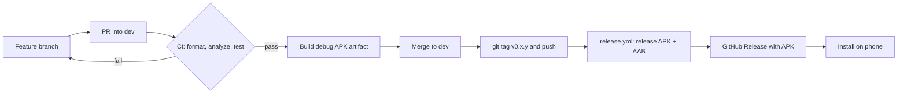

# CI/CD walkthrough: Azure DevOps brain, GitHub Actions hands

I build and release this app with **GitHub Actions** on GitHub-hosted runners. Builds used to happen on an AI cloud desktop; now every PR, debug APK and release APK comes from a pipeline in this repo that anyone can read. By day I'm an Azure DevOps engineer, so these notes map each piece back to what I already know from ADO.

## The pipelines

| File | Trigger | What it does |
|------|---------|--------------|
| [`.github/workflows/ci.yml`](../.github/workflows/ci.yml) | PR into `dev`/`main`, push to `dev` | **Analyze, format & test** (`dart format`, `flutter analyze`, `flutter test` with goldens), then **Build debug APK** and upload it as an artifact |
| [`.github/workflows/release.yml`](../.github/workflows/release.yml) | tag `v*`, manual run; dry run on PRs touching it or `android/**` | Release APK + AAB, signed if the secrets exist (debug-signed otherwise), then a GitHub Release with the APK attached |
| [`.github/dependabot.yml`](../.github/dependabot.yml) | weekly | PRs for pub packages and GitHub Actions versions |

Flutter is pinned to **3.47.5** (the revision in `.metadata`) and the runner to `ubuntu-24.04`, which keeps the golden screenshot tests stable.

## ADO → GitHub mapping

| Azure DevOps | GitHub Actions (this repo) |
|--------------|----------------------------|
| `azure-pipelines.yml` | `.github/workflows/*.yml`, one file per pipeline |
| Stages / jobs / `dependsOn` | Jobs plus `needs:` (`debug-apk` needs `checks`) |
| Tasks (`Gradle@3`, `PublishPipelineArtifact@1`) | Actions (`subosito/flutter-action`, `actions/upload-artifact`) and `run:` steps |
| Library variable groups / secure files | Repo **secrets**. GitHub has no secure files, so the keystore goes in as a base64 secret and gets decoded on the runner |
| Pipeline artifacts | `actions/upload-artifact` (download from the run page) |
| Release pipeline + stages | Tag-triggered `release.yml` + **GitHub Releases** |
| Agent pools (Microsoft-hosted) | Hosted runners (`runs-on: ubuntu-24.04`) |
| Branch policies (build validation, min reviewers) | Branch protection / **rulesets** with required status checks |
| `Cache@2` | Built-in caching in `setup-java` (Gradle) and `flutter-action` (SDK + pub) |

## Flow



## Cutting a release

1. Bump `version:` in `pubspec.yaml` (for example `0.1.4+5`) in a normal PR and merge it.
2. Tag the merge commit on `dev` and push the tag:
   ```bash
   git checkout dev && git pull
   git tag -a v0.1.4 -m "v0.1.4"
   git push origin v0.1.4
   ```
3. Watch it: `gh run watch` or the Actions tab. The Release shows up under **Releases**.

The versionName comes from the tag and the versionCode from the `+N` in `pubspec.yaml`, so I keep the two in step. The workflow warns when they disagree.

## One-time setup: release signing secrets

Until these four secrets exist, releases are **debug-signed**: fine for sideloading, rejected by Google Play, and marked as a pre-release.

**If I already have an upload key** (the `android/key.properties` I use for Play uploads), I reuse it. Play only accepts bundles signed with the registered upload key. A new key is only for when there isn't one yet:

```bash
keytool -genkeypair -v -keystore upload-keystore.jks -storetype JKS \
  -keyalg RSA -keysize 2048 -validity 10000 -alias upload
```

Then load it into the repo secrets. `gh secret set` prompts for the value when there's no `--body`, so passwords stay out of shell history:

```bash
R=dkelertas-homelab/good-pro-portion
base64 -w0 upload-keystore.jks | gh secret set ANDROID_KEYSTORE_BASE64 -R $R   # macOS: base64 -i upload-keystore.jks
gh secret set ANDROID_KEYSTORE_PASSWORD -R $R
gh secret set ANDROID_KEY_ALIAS -R $R          # e.g. upload
gh secret set ANDROID_KEY_PASSWORD -R $R
gh secret list -R $R
```

The `.jks` file itself stays out of git (`.gitignore` covers `*.jks` and `*.keystore`) and lives in my password manager plus an offline backup. Losing the upload key means asking Google for an upload key reset.

How the build uses it: `release.yml` decodes the keystore to `$RUNNER_TEMP`, exports `ANDROID_KEYSTORE_PATH` plus the three passwords and alias, and `android/app/build.gradle.kts` checks `android/key.properties` first, then those env vars, then falls back to debug signing. The keystore is deleted at the end of the job.

## Required checks (once the repo is public)

On a free personal account, rulesets and branch protection on a **private** repo return `403 Upgrade to GitHub Pro`, so for now the PR check is a convention rather than enforced. Once the repo is public, run this to require the check on `dev` and block force-pushes and deletion (the ADO "build validation" branch policy):

```bash
gh api -X POST repos/dkelertas-homelab/good-pro-portion/rulesets --input - <<'JSON'
{
  "name": "dev: require CI",
  "target": "branch",
  "enforcement": "active",
  "conditions": { "ref_name": { "include": ["refs/heads/dev"], "exclude": [] } },
  "rules": [
    { "type": "deletion" },
    { "type": "non_fast_forward" },
    { "type": "pull_request", "parameters": { "required_approving_review_count": 0, "dismiss_stale_reviews_on_push": false, "require_code_owner_review": false, "require_last_push_approval": false, "required_review_thread_resolution": false } },
    { "type": "required_status_checks", "parameters": { "strict_required_status_checks_policy": false, "required_status_checks": [ { "context": "Analyze, format & test" }, { "context": "Build debug APK" } ] } }
  ]
}
JSON
```

## Installing a Release APK on my Samsung phone

1. On the phone, open the repo's **Releases** page in Chrome or Samsung Internet (sign in to GitHub while the repo is private).
2. Under **Assets**, tap `good-pro-portion-vX.Y.Z….apk` to download it.
3. Open the download. The first time, Android says installs from this source aren't allowed: tap **Settings** and turn on **Allow from this source** for that browser or My Files.
4. If **Auto Blocker** is on (Settings → Security and privacy → Auto Blocker), it blocks sideloading. Turn it off for the install and back on afterwards.
5. If Play Protect warns about an unknown app, tap **More details → Install anyway**.
6. "App not installed" / "package conflicts" means the copy already on the phone is signed with a different key (debug builds from another machine, for example). Uninstall it first. That wipes local history and settings.

## Links to brush up

- [GitHub Actions workflow syntax](https://docs.github.com/en/actions/reference/workflows-and-actions/workflow-syntax)
- [Using secrets in GitHub Actions](https://docs.github.com/en/actions/how-tos/write-workflows/choose-what-workflows-do/use-secrets)
- [actions/upload-artifact](https://github.com/actions/upload-artifact)
- [About GitHub Releases](https://docs.github.com/en/repositories/releasing-projects-on-github/about-releases)
- [softprops/action-gh-release](https://github.com/softprops/action-gh-release)
- [About rulesets (branch protection)](https://docs.github.com/en/repositories/configuring-branches-and-merges-in-your-repository/managing-rulesets/about-rulesets)
- [Dependabot options reference](https://docs.github.com/en/code-security/reference/supply-chain-security/dependabot-options-reference)
- [`gh secret set`](https://cli.github.com/manual/gh_secret_set)
- [Flutter: continuous delivery](https://docs.flutter.dev/deployment/cd)
- [Flutter: build and release an Android app](https://docs.flutter.dev/deployment/android)
- [Android: sign your app](https://developer.android.com/studio/publish/app-signing)
- [subosito/flutter-action](https://github.com/subosito/flutter-action)
- [Azure Pipelines YAML schema](https://learn.microsoft.com/en-us/azure/devops/pipelines/yaml-schema/?view=azure-pipelines)
- [Microsoft Learn: Migrate your CI/CD pipelines to GitHub with GitHub Actions Importer](https://learn.microsoft.com/en-us/training/modules/migrate-cicd-pipelines-to-github-with-github-actions-importer/)
- [Microsoft Learn: Migrate pipelines (Azure Pipelines vs GitHub Actions table)](https://learn.microsoft.com/en-us/azure/devops/organizations/projects/migrate-public-project?view=azure-devops#migrate-pipelines)
- [GitHub Docs: Migrating from Azure Pipelines to GitHub Actions](https://docs.github.com/en/actions/tutorials/migrate-to-github-actions/manual-migrations/migrate-from-azure-pipelines)
